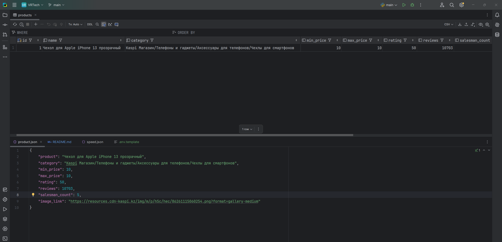
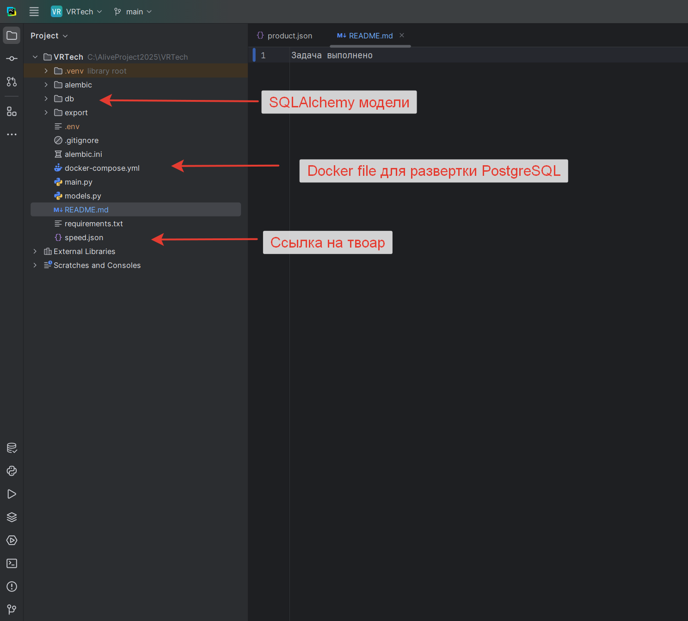

<h1>Задача выполнено</h1>
<h1>Результаты:</h1>

# VRTech Kaspi Parser

Тестовое задание Python Backend-разработчика для работы с Kaspi Marketplace.

---

# Создание venv
python -m venv .venv

.venv\Scripts\activate

pip install --upgrade pip
pip install -r requirements.txt

# Развертка контейнера 
docker-compose up -d

# Создаем env
DB_HOST=localhost\

DB_PORT=1234

DB_USER=admin

DB_PASS=admin

DB_NAME=kaspi_db

alembic init alembic
alembic upgrade head

Запуск основного кода